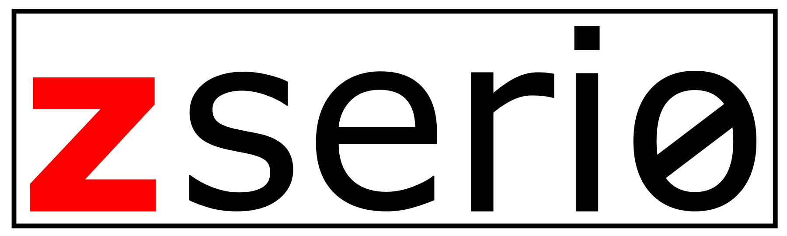

***z*** ero ***seri*** alization ***o*** verhead

[](https://travis-ci.org/ndsev/zserio)

--------
No time to read? Go to the [Quick Start](#quick-start) or [download latest release](https://github.com/ndsev/zserio/releases/latest).

In for the numbers? Head over to [benchmarks](benchmarks/README.md).

Questions? Check the [FAQs](doc/FAQ.md).

More documentation? Go to the [Documentation](#documentation).

------

## Serialization framework

The zserio serialization framework allows you to serialize data in a compact and efficient way.

The key features include

- compactness (smaller than most other serializers)
- advanced schema definition options
- cross-platform
- multiple programming languages


It can be retrofitted on top of almost any other serialization language or model, since it gives the developer
powerful low-level access.

It features simple and compound data structures and provides advanced features for controlling at design time
what writers will be able to fill in.

Although it does not have a wire format, we have added some convenience keywords lately that encapsulate some
functionality. You can find more information on [Zserio Invisibles](doc/ZserioInvisibles.md).

At the moment the following languages are supported
- C++
- Java
- Python

## Quick introduction

As we have stated earlier, zserio does not have any wire format. So basically: what you see is what you get
(please note that zserio uses network byte order in the serialized stream, but the generated code does take
care of this).

```
package tutorial;

struct Employee
{
    uint8   age;
    string  name;
    uint16  salary;
    Role    role;
};

enum uint8 Role
{
    DEVELOPER = 0,
    TEAM_LEAD = 1,
    CTO       = 2,
};
```

So if we use the schema above and serialize one employee with

- age = 32
- name = Joe Smith
- salary = 5000 $
- role = DEVELOPER

the resulting byte stream looks like this:

```
Offset(d) 00 01 02 03 04 05 06 07 08 09 10 11 12 13

00000000  20 09 4A 6F 65 20 53 6D 69 74 68 13 88 00
```

Byte position | value             | value (hex)                | comment
------------- | ----------------- | -------------------------- | -----------------------
0             | 32 (age)          | 20                         | uint8 is of fixed size 8 bit
1             | 9 (string length) | 09                         | string length is encoded in varuint64 field before actual string
2-10          | Joe Smith         | 4A 6F 65 20 53 6D 69 74 68 | UTF-8 encoded string
11-12         | 5000              | 13 88                      | `uint16` always uses 2 bytes
13            | 0                 | 00                         | enum is of size `uint8` so it uses 1 byte

Please note that in contrast to other serialization mechanisms zserio supports as well variable integers which
do not provide the full range of values but rather stick to the indicated size. Example: a *varuint64* will be
using max 8 bytes whilst not providing the full range of a *uint64_t* but a *varuint* will be using max
9 bytes and providing the full range of a *uint64_t*.

## Quick Start

To be able to serialize data with zserio, you have to follow these basic steps:

1. Download the runtimes and the zserio compiler from [Github Releases](https://github.com/ndsev/zserio/releases/latest)
2. Set up your development environment with the zserio runtime
3. Write the schema definition
4. Compile the schema and generate code
5. Serialize/deserialize using the generated code

You can find the detailed quick start tutorial in their respective repositories:

- [C++ Tutorial](https://github.com/ndsev/zserio-tutorial-cpp#zserio-c-quick-start-tutorial)
- [Java Tutorial](https://github.com/ndsev/zserio-tutorial-java#zserio-java-quick-start-tutorial)
- [Python Tutorial](https://github.com/ndsev/zserio-tutorial-python#zserio-python-quick-start-tutorial)


## Features overview

- optional elements
- constraints
- default values
- parameters
- alignments
- offsets
- arrays with indexed offsets

## Documentation

Documentation of the schema language can be found in the
[Zserio Language Overview](doc/ZserioLanguageOverview.md).

Explanation of more hidden schema language features can be found in the
[Zserio Invisibles](doc/ZserioInvisibles.md).

Schema language reference can be found in [Quick Reference](doc/ZserioQuickReference.md).

User Guide can be found in the [Zserio Compiler User Guide](doc/ZserioUserGuide.md).

Build instructions can be found in the [Zserio Compiler Build Instructions](doc/ZserioBuildInstructions.md).

C++ users can find more information in the
[C++ Tutorial](https://github.com/ndsev/zserio-tutorial-cpp#zserio-c-quick-start-tutorial).

Java users can find more information in the
[Java Tutorial](https://github.com/ndsev/zserio-tutorial-java#zserio-java-quick-start-tutorial).

Python users can find more information in the
[Python Tutorial](https://github.com/ndsev/zserio-tutorial-python#zserio-python-quick-start-tutorial).

Check out as well the [Zserio Types Mapping](doc/ZserioTypesMapping.md) for types mapping description.
